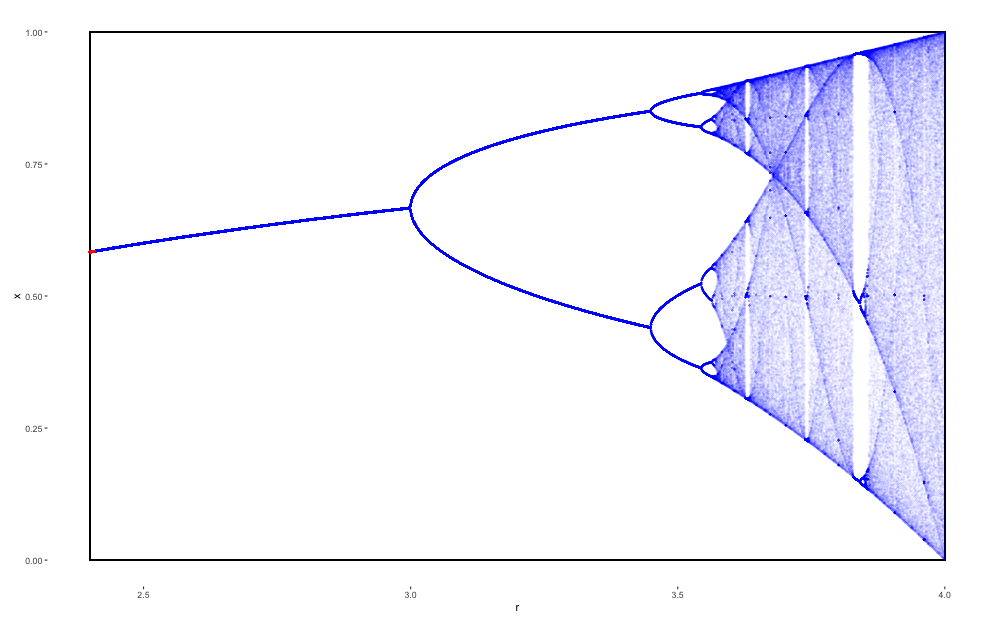

```{r setup, include = FALSE}
knitr::opts_chunk$set(echo = TRUE)
library(tidyverse)
library(gganimate)
library(viridis)
library(caTools)
library(ggraph)
```

<!-- **Pamięci prof. Mitchella J. Feigenbauma (10.12.1944 - 30.06.2019)** -->

# Wstęp do chaosu deterministycznego

Pierwsze odkrycia dotyczące chaosu przypisuje się Hadamardowi za jego pracę z 1898 roku na temat trajektorii kul poruszających się bez tarcia po powierzchni o ujemnej krzywiźnie. W ramach przyjętych warunków wszystkie takie trajektorie oddalają się od siebie eksponencjalnie z czasem, tzn. jak $e^{\lambda t}$, gdzie dodatni parametr $\lambda$ nazywany jest wykładnikiem Lapunowa. Mówi się wówczas o niestabilności trajektorii, której miarą jest wykładnik Lapunowa. Owa niestabliność jest cechą charakterystyczną układów chaotycznych -- układów, w których nawet najdrobniejsza zmiana warunków początkowych prowadzi po pewnym czasie do drastycznie innego zachowania. 

O ile potocznie chaos rozumiany jest jako coś przypadkowego, niezorganizowanego i nieuporządkowanego, to z formalnego punktu widzenia chaotyczność jest cechą układów deterministycznych, czyli takich, w których nie ma przypadkowości. Ewolucja układów deterministycznych w czasie jest ściśle określona i zawsze taka sama dla konkretnie wybranych warunków początkowych. Chaotyczność w ujęciu matematycznym nie jest bowiem miarą tego, jak skomplikowany ruch wykonuje jakiś układ dynamiczny. Podkreśla się to używając na pozór oksymoronicznego wyrażenia **chaos deterministyczny**. 


## Chaos i determinizm w wahadle podwójnym

Aby lepiej zrozumieć czym jest chaos deterministyczny warto posłużyć się konkretnym przykładem. Jednym z najprostrzych układów dynamicznych, intuicyjnym w interpretacji i jednocześnie wykazującym zachowania chaotyczne, jest wahadło podwójne. Wahadło podwójne to analog zwykłego wahadła, z tą różnicą, że do zawieszonej na sztywnym i nieważkim pręcie masy $m_1$ doczepione jest drugie wahadło z masą $m_2$. Całość znajduje się w jednorodnym polu grawitacyjnym o przyspieszeniu $g$. 


### Ruch wahadła podwójnego

Długości $l_1$ i $l_2$ wahadeł mogą być w ogólności różne, podobnie masy. Rozpatrzmy jednak przypadek, gdzie $m_1 = m_2 = 1$ kg oraz $l_1 = l_2 = 1$ m. Poniższy fragment kodu tworzy animację obrazującą ruch takiego wahadła przy założeniu braku dyssypacji energii poprzez oporu ruchu. Dodatkowo animacja przedstawia nie tylko aktualne położenie wahadła, ale również jego nieodległą przeszłość w postaci zanikającego powidoku, by lepiej można było przyjrzeć się fascynującej trajektorii obieranej przez jakże prosty koncepcyjnie układ fizyczny.

```{r doublePendulum, echo = TRUE}

# constants
gravitationalConstant <- 9.81  # acceleration due to gravity [m/s^2]
p1Length <- 1.0                # length of pendulum 1 [m]
p1Mass <- 1.0                  # mass of pendulum 1 [kg]
p2Length <- 1.0                # length of pendulum 2 [m]
p2Mass <- 1.0                  # mass of pendulum 2 [kg]

# initial conditions
p1Angle <- 120.0               # angle of pendulum 1 [degree]
p1AngularVelocity <- 0.0       # angular velocity of pendulum 1
p2Angle <- 150.0               # angle of pendulum 2 [degree]
p2AngularVelocity <- 0.0       # angular velocity of pendulum 2
dt = 0.001                     # time step [s]
totalTime = 30.00               # total time of animation [s]

init <- c(p1Angle, p1AngularVelocity, p2Angle, p2AngularVelocity) * pi / 180 # [conversion to radians]

# definition of the function calculating data points for the double pendulum problem
getDoublePendulum <- function(init, dt, totalTime) {
  # declarations - BEGIN
  time = 0.0
  p1Angle = init[1]
  p1AngularVelocity = init[2]
  p1AngularAcceleration = 0.0
  p2Angle = init[3]
  p2AngularVelocity = init[4]
  p2AngularAcceleration = 0.0
  
  nSteps = floor(totalTime / dt)
  pendulum = matrix(nrow = nSteps, ncol = length(init) + 1)
  # declarations - END
  
  pendulum[1, 1] = time
  pendulum[1, 2] = p1Angle
  pendulum[1, 3] = p1AngularVelocity
  pendulum[1, 4] = p2Angle
  pendulum[1, 5] = p2AngularVelocity
    
  for(it in 2:nSteps) {
    # update of time
    time = time + dt
    
    # calculation of angular acceleration (mathematical formula can be found at myphysicslab.com)
    p1Numerator1 = -gravitationalConstant * ((2.0 * p1Mass + p2Mass) * sin(p1Angle) + p2Mass * sin(p1Angle - 2.0 * p2Angle))
    p1Numerator2 = -2.0 * p2Mass * sin(p1Angle - p2Angle) * ((p2AngularVelocity ^ 2) * p2Length + (p1AngularVelocity ^ 2) * p1Length * cos(p1Angle - p2Angle))
    p1Denominator = p1Length * (2.0 * p1Mass + p2Mass * (1.0 - cos(2.0 * (p1Angle - p2Angle))))
    
    p1AngularAcceleration = (p1Numerator1 + p1Numerator2) / p1Denominator
    
    p2Numerator1 = (p1Mass + p2Mass) * (gravitationalConstant * cos(p1Angle) + p1Length * (p1AngularVelocity ^ 2))
    p2Numerator2 = ((p2AngularVelocity ^ 2) * p2Length * p2Mass * cos(p1Angle - p2Angle))
    p2Denominator = p1Denominator * p2Length / p1Length
    
    p2AngularAcceleration = 2.0 * sin(p1Angle - p2Angle) * (p2Numerator1 + p2Numerator2) / p2Denominator
    
    # calculation of angular velocity
    p1AngularVelocity = p1AngularVelocity + p1AngularAcceleration * dt
    p2AngularVelocity = p2AngularVelocity + p2AngularAcceleration * dt
    
    # calculation of angles
    p1Angle = p1Angle + p1AngularVelocity * dt
    p2Angle = p2Angle + p2AngularVelocity * dt
    
    # storage of the data
    pendulum[it, 1] = time
    pendulum[it, 2] = p1Angle
    pendulum[it, 3] = p1AngularVelocity
    pendulum[it, 4] = p2Angle
    pendulum[it, 5] = p2AngularVelocity
    # note that not every step of calculations must become a frame of animation
    # data should be reduced only before passing it to the function creating animation
  }
    
  return(pendulum)
}

# calculation of data points for the double pendulum problem
pendulum <- getDoublePendulum(init, dt, totalTime)

# definition of the function converting radial coordinates to cartesian ones
getCartesianCoordinates <- function(radialCoordinates) {
  p1Angles = radialCoordinates[ , 2]
  p2Angles = radialCoordinates[ , 3]
  
  p1x = p1Length * sin(p1Angles)
  p1y = -p1Length * cos(p1Angles)
  p2x = p1x + p2Length * sin(p2Angles)
  p2y = p1y - p2Length * cos(p2Angles)
  
  cartesianCoordinates <- matrix(nrow = length(p1Angles), ncol = 5)
  cartesianCoordinates[ , 1] = radialCoordinates[ , 1]
  cartesianCoordinates[ , 2] = p1x
  cartesianCoordinates[ , 3] = p1y
  cartesianCoordinates[ , 4] = p2x
  cartesianCoordinates[ , 5] = p2y
  
  return(cartesianCoordinates)
}

coordinates <- getCartesianCoordinates(pendulum[ ,c(1, 2, 4)])

# animation
reduction = 20
time <- coordinates[1, 1]
p1x <- coordinates[1, 2]
p1y <- coordinates[1, 3]
p2x <- coordinates[1, 4]
p2y <- coordinates[1, 5]
accumulatedTime <- time
for(it in 1 : (dim(coordinates)[1] / reduction - 1)) {
    which = 1 + it * reduction
    time[length(time) + 1] <- coordinates[which, 1]
    p1x[length(p1x) + 1] <- coordinates[which, 2]
    p1y[length(p1y) + 1] <- coordinates[which, 3]
    p2x[length(p2x) + 1] <- coordinates[which, 4]
    p2y[length(p2y) + 1] <- coordinates[which, 5]
}

drawingData <- tibble(time, p1x, p1y, p2x, p2y, group = 1)

ggplot(drawingData) +
  geom_segment(aes(x = -3.2, xend = 3.2, y = -2.4, yend = -2.4)) +
  geom_segment(aes(x = -3.2, xend = -3.2, y = -2.4, yend = 2.4)) +
  geom_segment(aes(x = 3.2, xend = 3.2, y = -2.4, yend = 2.4)) +
  geom_segment(aes(x = -3.2, xend = 3.2, y = 2.4, yend = 2.4)) +
  geom_segment(aes(x = 0, y = 0, xend = p1x, yend = p1y)) +
  geom_segment(aes(x = p1x, y = p1y, xend = p2x, yend = p2y)) +
  geom_point(x = 0, y = 0, size  = 2.0) +
  geom_point(aes(p1x, p1y), col = "red", size = 5.0 * p1Mass) +
  geom_point(aes(p2x, p2y), col = "blue", size = 5.0 * p2Mass) +
  scale_y_continuous(limits = c(-2.4, 2.4)) +
  scale_x_continuous(limits = c(-3.2, 3.2)) +
  ggraph::theme_graph() +
  labs(title="{floor(frame_time)} s") +
  shadow_wake(wake_length = 1.0 / totalTime, alpha = 0.2, wrap = FALSE) +
  transition_time(time) -> pendulumPlots
  pendulumPlots <- pendulumPlots + coord_fixed()

pendulumAnimation <- animate(pendulumPlots, nframes = nrow(drawingData), fps = 25, height = 800, width = 800)
pendulumAnimation

```


Zachowanie wahadła podwójnego jest w pełni zdeterminowane poprzez następujące równania ruchu.

$$\ddotθ_1=\frac{-g(2m_1+m_2)\sinθ_1−m_2g\sin(θ_1−2θ_2)−2\sin(θ_1−θ_2)m_2(\dotθ^2_2l_2+\dotθ^2_1l_1\cos(θ_1−θ_2))}{l_1(2m_1+m_2−m_2\cos(2θ_1−2θ_2))}$$

$$\ddotθ_2=\frac{2\sin(θ_1−θ_2)(\dotθ^2_1l_1(m_1+m_2)+g(m_1+m_2)\cosθ_1+\dotθ^2_2l_2m_2\cos(θ_1−θ_2))}{l_2(2m_1+m_2−m_2\cos(2θ_1−2θ_2))}$$

$θ_1$ i $θ_2$ to odpowiednio wychylenia z położenia równowagi ramion wahadła $l_1$ i $l_2$. W równaniach tych nie występują żadne zmienne losowe -- nie ma tutaj mowy o jakiejkolwiek przypadkowości. 


### Wahadło jako układ chaotyczny

O tym, że wahadło podwójne ma charakter chaotyczny można się przekonać porównując ze sobą ruch większej liczby wahadeł nieznacznie różniąniących się od siebie położeniem początkowym. Poniższa animacja przedstawia 7 takich wahadeł.

```{r dPendulum7, echo = FALSE}

# constants
gravitationalConstant <- 9.81  # acceleration due to gravity [m/s^2]
p1Length <- 1.0                # length of pendulum 1 [m]
p1Mass <- 1.0                  # mass of pendulum 1 [kg]
p2Length <- 1.0                # length of pendulum 2 [m]
p2Mass <- 1.0                  # mass of pendulum 2 [kg]

# initial conditions
p1Angle <- rep(120.0, 7)               
p1AngularVelocity <- rep(0.0, 7)     
p2Angle <- rep(1500 : 1506) / 10
p2AngularVelocity <- rep(0.0, 7)  
dt = 0.001                      
totalTime = 15.0              

p1Angle = p1Angle * pi / 180
p1AngularVelocity = p1AngularVelocity * pi / 180
p2Angle = p2Angle * pi / 180
p2AngularVelocity = p2AngularVelocity * pi / 180

# definition of the function calculating data points for the double pendulum problem
get7Pendulum <- function(p1Angle, p1AngularVelocity, p2Angle, p2AngularVelocity, dt, totalTime) {
  # declarations - BEGIN
  
  time = 0.0
  p1AngularAcceleration = 0.0
  p2AngularAcceleration = 0.0
  
  nSteps = floor(totalTime / dt)
  pendulum = matrix(nrow = nSteps, ncol = 29)
  # declarations - END
  
  pendulum[1, 1:7] = p1Angle
  pendulum[1, 8:14] = p1AngularVelocity
  pendulum[1, 15:21] = p2Angle
  pendulum[1, 22:28] = p2AngularVelocity
  pendulum[1, 29] = time
  
  for(it in 2:nSteps) {
    # update of time
    time = time + dt
    
    # calculation of angular acceleration (mathematical formula can be found at myphysicslab.com)
    p1Numerator1 = -gravitationalConstant * ((2.0 * p1Mass + p2Mass) * sin(p1Angle) + p2Mass * sin(p1Angle - 2.0 * p2Angle))
    p1Numerator2 = -2.0 * p2Mass * sin(p1Angle - p2Angle) * ((p2AngularVelocity ^ 2) * p2Length + (p1AngularVelocity ^ 2) * p1Length * cos(p1Angle - p2Angle))
    p1Denominator = p1Length * (2.0 * p1Mass + p2Mass * (1.0 - cos(2.0 * (p1Angle - p2Angle))))
    
    p1AngularAcceleration = (p1Numerator1 + p1Numerator2) / p1Denominator
    
    p2Numerator1 = (p1Mass + p2Mass) * (gravitationalConstant * cos(p1Angle) + p1Length * (p1AngularVelocity ^ 2))
    p2Numerator2 = ((p2AngularVelocity ^ 2) * p2Length * p2Mass * cos(p1Angle - p2Angle))
    p2Denominator = p1Denominator * p2Length / p1Length
    
    p2AngularAcceleration = 2.0 * sin(p1Angle - p2Angle) * (p2Numerator1 + p2Numerator2) / p2Denominator
    
    # calculation of angular velocity
    p1AngularVelocity = p1AngularVelocity + p1AngularAcceleration * dt
    p2AngularVelocity = p2AngularVelocity + p2AngularAcceleration * dt
    
    # calculation of angles
    p1Angle = p1Angle + p1AngularVelocity * dt
    p2Angle = p2Angle + p2AngularVelocity * dt
    
    # storage of the data
    pendulum[it, 1:7] = p1Angle
    pendulum[it, 8:14] = p1AngularVelocity
    pendulum[it, 15:21] = p2Angle
    pendulum[it, 22:28] = p2AngularVelocity
    pendulum[it, 29] = time
  }
  
  return(pendulum)
}

# calculation of data points for the double pendulum problem
pendulum <- get7Pendulum(p1Angle, p1AngularVelocity, p2Angle, p2AngularVelocity, dt, totalTime)

# definition of the function converting radial coordinates to cartesian ones
getCartesianCoordinates <- function(radialCoordinates) {
  p1Angles = radialCoordinates[ , 1:7]
  p2Angles = radialCoordinates[ , 8:14]
  
  p1x = p1Length * sin(p1Angles)
  p1y = -p1Length * cos(p1Angles)
  p2x = p1x + p2Length * sin(p2Angles)
  p2y = p1y - p2Length * cos(p2Angles)
  
  cartesianCoordinates <- matrix(nrow = nrow(p1Angles), ncol = 29)
  cartesianCoordinates[ , 1:7] = p1x
  cartesianCoordinates[ , 8:14] = p1y
  cartesianCoordinates[ , 15:21] = p2x
  cartesianCoordinates[ , 22:28] = p2y
  cartesianCoordinates[ , 29] = radialCoordinates[ , 15]
  
  return(cartesianCoordinates)
}

coordinates <- getCartesianCoordinates(pendulum[ ,c(1:7, 15:21, 29)])

# animation
reduction = 10
reducedLength = dim(coordinates)[1] / reduction
time <- rep(0.0, reducedLength)
p1x <- matrix(nrow = reducedLength, ncol = 7)
p1y <- matrix(nrow = reducedLength, ncol = 7)
p2x <- matrix(nrow = reducedLength, ncol = 7)
p2y <- matrix(nrow = reducedLength, ncol = 7)
accumulatedTime <- time
for(it in 1 : reducedLength) {
  which = 1 + (it - 1) * reduction
  time[it] <- coordinates[which, 29]
  p1x[it, ] <- coordinates[which, 1:7]
  p1y[it, ] <- coordinates[which, 8:14]
  p2x[it, ] <- coordinates[which, 15:21]
  p2y[it, ] <- coordinates[which, 22:28]
}

drawingData <- tibble(time, p1x, p1y, p2x, p2y, group = 1)

ggplot(drawingData) +
  geom_segment(aes(x = -6.4, xend = 6.4, y = -2.4, yend = -2.4)) +
  geom_segment(aes(x = -6.4, xend = -6.4, y = -2.4, yend = 2.4)) +
  geom_segment(aes(x = 6.4, xend = 6.4, y = -2.4, yend = 2.4)) +
  geom_segment(aes(x = -6.4, xend = 6.4, y = 2.4, yend = 2.4)) +
  geom_segment(aes(x = 0, xend = 0, y = -2.4, yend = 2.4)) +
  geom_segment(aes(x = -3.2, y = 0, xend = p1x[ , 1] - 3.2, yend = p1y[ , 1])) +
  geom_segment(aes(x = -3.2, y = 0, xend = p1x[ , 2] - 3.2, yend = p1y[ , 2])) +
  geom_segment(aes(x = -3.2, y = 0, xend = p1x[ , 3] - 3.2, yend = p1y[ , 3])) +
  geom_segment(aes(x = -3.2, y = 0, xend = p1x[ , 4] - 3.2, yend = p1y[ , 4])) +
  geom_segment(aes(x = -3.2, y = 0, xend = p1x[ , 5] - 3.2, yend = p1y[ , 5])) +
  geom_segment(aes(x = -3.2, y = 0, xend = p1x[ , 6] - 3.2, yend = p1y[ , 6])) +
  geom_segment(aes(x = -3.2, y = 0, xend = p1x[ , 7] - 3.2, yend = p1y[ , 7])) +
  geom_segment(aes(x = p1x[ , 1] - 3.2, y = p1y[ , 1], xend = p2x[ , 1] - 3.2, yend = p2y[ , 1])) +
  geom_segment(aes(x = p1x[ , 2] - 3.2, y = p1y[ , 2], xend = p2x[ , 2] - 3.2, yend = p2y[ , 2])) +
  geom_segment(aes(x = p1x[ , 3] - 3.2, y = p1y[ , 3], xend = p2x[ , 3] - 3.2, yend = p2y[ , 3])) +
  geom_segment(aes(x = p1x[ , 4] - 3.2, y = p1y[ , 4], xend = p2x[ , 4] - 3.2, yend = p2y[ , 4])) +
  geom_segment(aes(x = p1x[ , 5] - 3.2, y = p1y[ , 5], xend = p2x[ , 5] - 3.2, yend = p2y[ , 5])) +
  geom_segment(aes(x = p1x[ , 6] - 3.2, y = p1y[ , 6], xend = p2x[ , 6] - 3.2, yend = p2y[ , 6])) +
  geom_segment(aes(x = p1x[ , 7] - 3.2, y = p1y[ , 7], xend = p2x[ , 7] - 3.2, yend = p2y[ , 7])) +
  geom_point(x = -3.2, y = 0, size  = 2.0) +
  geom_point(aes(p1x[ , 1] - 3.2, p1y[ , 1]), col = "dark gray", size = 5.0 * p1Mass) +
  geom_point(aes(p1x[ , 2] - 3.2, p1y[ , 2]), col = "dark gray", size = 5.0 * p1Mass) +
  geom_point(aes(p1x[ , 3] - 3.2, p1y[ , 3]), col = "dark gray", size = 5.0 * p1Mass) +
  geom_point(aes(p1x[ , 4] - 3.2, p1y[ , 4]), col = "dark gray", size = 5.0 * p1Mass) +
  geom_point(aes(p1x[ , 5] - 3.2, p1y[ , 5]), col = "dark gray", size = 5.0 * p1Mass) +
  geom_point(aes(p1x[ , 6] - 3.2, p1y[ , 6]), col = "dark gray", size = 5.0 * p1Mass) +
  geom_point(aes(p1x[ , 7] - 3.2, p1y[ , 7]), col = "dark gray", size = 5.0 * p1Mass) +
  geom_point(aes(p2x[ , 1] - 3.2, p2y[ , 1]), col = "magenta", size = 5.0 * p2Mass) +
  geom_point(aes(p2x[ , 2] - 3.2, p2y[ , 2]), col = "purple", size = 5.0 * p2Mass) +
  geom_point(aes(p2x[ , 3] - 3.2, p2y[ , 3]), col = "blue", size = 5.0 * p2Mass) +
  geom_point(aes(p2x[ , 4] - 3.2, p2y[ , 4]), col = "green", size = 5.0 * p2Mass) +
  geom_point(aes(p2x[ , 5] - 3.2, p2y[ , 5]), col = "yellow", size = 5.0 * p2Mass) +
  geom_point(aes(p2x[ , 6] - 3.2, p2y[ , 6]), col = "orange", size = 5.0 * p2Mass) +
  geom_point(aes(p2x[ , 7] - 3.2, p2y[ , 7]), col = "red", size = 5.0 * p2Mass) +
  geom_point(aes(p2x[ , 1] + 3.2, p2y[ , 1]), col = "magenta", size = 5.0 * p2Mass) +
  geom_point(aes(p2x[ , 2] + 3.2, p2y[ , 2]), col = "purple", size = 5.0 * p2Mass) +
  geom_point(aes(p2x[ , 3] + 3.2, p2y[ , 3]), col = "blue", size = 5.0 * p2Mass) +
  geom_point(aes(p2x[ , 4] + 3.2, p2y[ , 4]), col = "green", size = 5.0 * p2Mass) +
  geom_point(aes(p2x[ , 5] + 3.2, p2y[ , 5]), col = "yellow", size = 5.0 * p2Mass) +
  geom_point(aes(p2x[ , 6] + 3.2, p2y[ , 6]), col = "orange", size = 5.0 * p2Mass) +
  geom_point(aes(p2x[ , 7] + 3.2, p2y[ , 7]), col = "red", size = 5.0 * p2Mass) +
  geom_path(aes(p2x[ , 1] + 3.2, p2y[ , 1]), col = "magenta", alpha = 0.2) +
  geom_path(aes(p2x[ , 2] + 3.2, p2y[ , 2]), col = "purple", alpha = 0.2) +
  geom_path(aes(p2x[ , 3] + 3.2, p2y[ , 3]), col = "blue", alpha = 0.2) +
  geom_path(aes(p2x[ , 4] + 3.2, p2y[ , 4]), col = "green", alpha = 0.2) +
  geom_path(aes(p2x[ , 5] + 3.2, p2y[ , 5]), col = "yellow", alpha = 0.2) +
  geom_path(aes(p2x[ , 6] + 3.2, p2y[ , 6]), col = "orange", alpha = 0.2) +
  geom_path(aes(p2x[ , 7] + 3.2, p2y[ , 7]), col = "red", alpha = 0.2) +
  scale_y_continuous(limits = c(-2.4, 2.4)) +
  scale_x_continuous(limits = c(-6.4, 6.4)) +
  ggraph::theme_graph() +
  labs(title="{floor(frame_along)} s") +
  transition_reveal(time) -> pendulum7Plots
  pendulum7Plots <- pendulum7Plots + coord_fixed()

pendulum7Animation <- animate(pendulum7Plots, nframes = nrow(drawingData) / 3, fps = 25, height = 600, width = 1200)
pendulum7Animation

```

Lewa część animacji przedstawia ruch wszystkich elementów wahadeł, natomiast po prawej stronie widoczne są tylko trajektorie mas znajdujących się na ich końcach. Chociaż początkowo ruch wahadeł wydaje się być jednakowy, to po pewnym czasie niewielka różnica w początkowym położeniu skutkuje zupełnie innymi trajektoriami. Przedstawiony tutaj przykład wahadła podwójnego w intuicyjny sposób obrazuje istotę chaosu deterministycznego - bardzo silną wrażliwość na warunki początkowe. 


# Atraktor Lorenza

Niemniej przeprowadzenie formalnego rozumowania dowodzącego chaotyczności potencjalnie chaotycznego układu jest dużo bardziej skomplikowane i specyficzne dla każdego przypadku. Dodatkowo nie wszystkie parametry początkowe muszą skutkować pojawieniem się zachowania chaotycznego. Interesującym przykładem układu, w którym zachowanie chaotyczne występuje tylko w pewnym przedziale parametrów jest tzw. atraktor Lorenza należący do klasy *dziwnych* atraktorów. Formalnie, atraktor jest zbiorem w przestrzeni fazowej, do którego zbiegają trajektorie rozpoczynające swoj bieg z różnych punktów tejże przestrzeni. Najczęściej jest to punkt lub okrąg, ale dziwny atraktor ma budowę fraktalną. 

## Trajektorie w układzie Lorenza

Układ Lorenza to uproszczona wersja równań Naviera-Stokesa modelująca w przybliżony sposób problem konwekcji termicznej w płynach uwzględniając takie parametry jak lepkość $\sigma$ i przewodnictwo cieplne $\rho$ osierodka.

$$\dot x = \sigma y - \sigma x$$

$$\dot y = -xz + \rho x - y$$

$$\dot z = xy - \beta z$$

Poniższy kod tworzy animację dwóch trajektorii rozpoczynających się niemal w tym samym punkcie przestrzeni w układzie Lorenza.


```{r lorenz, echo = TRUE}

# initial conditions (we consider two systems with slightly different initial position)
x <- c(2.0, 2.01)
y <- c(4.0, 4.0)
z <- c(8.0, 8.0)

dt <- 0.005
totalTime <- 30.0

getLorenzAttractor <- function(x, y, z, dt, totalTime) {
  # declarations - BEGIN
  sigma = 10.0
  rho = 28.0
  beta = 8.0 / 3.0
  
  time = 0.0
  
  nSteps = floor(totalTime / dt)
  attractor = matrix(nrow = nSteps, ncol = 5)  
  # declarations - END
  
  attractor[1, 1] = time
  attractor[1, 2] = x[1]
  attractor[1, 3] = z[1]
  attractor[1, 4] = x[2]
  attractor[1, 5] = z[2]
  
  for(it in 2:nSteps) {
    # update of time
    time = time + dt
    
    # calculations of Lorenz system
    dx = sigma * c(y[1] - x[1], y[2] - x[2]) * dt
    dy = c(x[1] * (rho - z[1]) - y[1], x[2] * (rho - z[2]) - y[2]) * dt
    dz = c(x[1] * y[1] - beta * z[1], x[2] * y[2] - beta * z[2]) * dt
    
    x = x + dx
    y = y + dy
    z = z + dz
    
    attractor[it, 1] = time
    attractor[it, 2] = x[1]
    attractor[it, 3] = z[1]
    attractor[it, 4] = x[2]
    attractor[it, 5] = z[2]
  }
  
  return(attractor)
}

attractor <- getLorenzAttractor(x, y, z, dt, totalTime)

# animation
time <- attractor[1, 1]
a1x <- attractor[1, 2]
a1y <- attractor[1, 3]
a2x <- attractor[1, 4]
a2y <- attractor[1, 5]
accumulatedTime <- time
for(it in 2 : dim(attractor)[1]) {
    time[length(time) + 1] <- attractor[it, 1]
    a1x[length(a1x) + 1] <- attractor[it, 2]
    a1y[length(a1y) + 1] <- attractor[it, 3]
    a2x[length(a2x) + 1] <- attractor[it, 4]
    a2y[length(a2y) + 1] <- attractor[it, 5]
}

drawingData <- tibble(time, a1x, a1y, a2x, a2y, group = 1)

ggplot(drawingData) +
  geom_segment(aes(x = -40, xend = 40, y = 0, yend = 0)) +
  geom_segment(aes(x = -40, xend = -40, y = 0, yend = 60)) +
  geom_segment(aes(x = 40, xend = 40, y = 0, yend = 60)) +
  geom_segment(aes(x = -40, xend = 40, y = 60, yend = 60)) +
  geom_point(aes(a1x, a1y), col = "red", size = 3.0) +
  geom_path(x = a1x, y = a1y, color = "red", alpha = 0.2) + 
  geom_point(aes(a2x, a2y), col = "blue", size = 3.0) +
  geom_path(x = a2x, y = a2y, color = "blue", alpha = 0.2) + 
  scale_y_continuous(limits = c(0, 60)) +
  scale_x_continuous(limits = c(-40, 40)) +
  ggraph::theme_graph() +
  labs(title="{floor(frame_along)} s") +
  transition_reveal(time) -> attractorPlots
  attractorPlots <- attractorPlots + coord_fixed()
  
attractorAnimation <- animate(attractorPlots, nframes = nrow(drawingData) / 5, fps = 25, height = 800, width = 800)
attractorAnimation

```

## Chaos w układzie Lorenza

Zachowanie chaotyczne pojawia się dla parametrów $\sigma = 10$, $\rho = 28$, $\beta = 8/3$ oraz w okolicach tych wartości, a atraktor Lorenza przyjmuje postać atraktora dziwnego o kształcie przypominającym motyla. Tak, jak w przypadku wahadła, można zauważyć, że po pewnym czasie trajektorie obu punktów znacznie się od siebie oddalają. Na pozór wydaje się, że układ ten posiada tylko dwa punkty, które zdają się *przyciągać* do siebie trajektorie startujące w różnych częściach przestrzeni. W rzeczywistości kształ atraktora Lorenza jest dużo bardziej złożnony, a punktów wchodzących w jego zbiór jest nieskończenie wiele.


# Teoria bifurkacji

Liczba punktów przyciągania i charakter atraktorów danego układu w ogólności zależy od parametrów opisujących go równań. Niekiedy zmiany mogą następować skokowo a liczba punktów przyciągania dążyć do nieskończoności. Nagła zmiana właściwości układu wynikająca z nieznacznej zmiany wartości jakiegoś parametru to tzw. bifurkacja. Jeśli w danym układzie występują bifurkacje, to można stworzyć dla tego układu diagram bifurkacyjny. 

## Diagram bifurkacyjny mapy logistycznej

Poniższy fragment kodu tworzy animację diagramu bifurkacyjnego dla odwzorowania logistycznego, $x_{n+1} = rx_n(1 - x_n)$. 

```{r bifurcation, eval = FALSE, echo = TRUE}

logisticMap <- function(lambda, n = 1000, m = 500) {
  xold = 0.01
  for (it in 1:n) {
    xnew = lambda * xold * (1.0 - xold)
    xold = xnew
  }
  result = matrix(nrow = m, ncol = 2)
  for(it in 1:m) {
    xnew = lambda * xold * (1.0 - xold)
    xold = xnew
    result[it, 1] = lambda
    result[it, 2] = xold
  }
  return(result)
}

min = 2.4
max = 4.0
kmax = 1600
m = 400
lambda = rep(0.0, (kmax + 1) * m)
attractor = rep(0.0, (kmax + 1) * m)
id = 1
for(ik in 0:kmax) {
  bif = logisticMap(min + (max - min) * (ik / kmax), 1000, m)
  lambda[id:(id + m - 1)] = bif[ , 1]
  attractor[id:(id + m - 1)] = bif[ , 2]
  id = id + m
}

drawingData <- tibble(lambda, attractor, group = 1)

ggplot(drawingData) +
  geom_segment(aes(x = min, xend = max, y = 0, yend = 0)) +
  geom_segment(aes(x = min, xend = max, y = 1, yend = 1)) +
  geom_segment(aes(x = min, xend = min, y = 0, yend = 1)) +
  geom_segment(aes(x = max, xend = max, y = 0, yend = 1)) +
  geom_point(aes(lambda, attractor), col = "red", size = 0.5, alpha = 0.05) +
  scale_y_continuous(limits = c(0.0, 1.0)) +
  scale_x_continuous(limits = c(min, max)) +
  labs(x = "r", y = "x") +
  theme(aspect.ratio = 0.618, panel.background = element_blank()) +
  shadow_mark(size = 0.5, alpha = 0.02, color = "blue", future = TRUE) +
  transition_time(lambda) -> bifurcationPlots

animate(bifurcationPlots, nframes = 100, fps = 25, width = 1000, height = 618)
anim_save(filename = "bifurcationDiagram.gif")

```



O równaniu logistycznym można myśleć jak o uproszczonym modelu opisującym zmiany wielkości pewnej populacji w czasie. Populacja ta reprodukuje się z szybkością proporcjonalną do wielkości populacji, gdy liczba osobników jest mała i wymiera, gdy rozmiar populacji zbliża się do maksymalnej pojemność środowiska. Dla $r < 3$ rozmiar populacji dąży do stałej, dla $r > 3$ rozmiar populacji oscyluje pomiędzy $2, 4, 8, 16, 32, \dots$ wartościami w zależności od wartości $r$.

Z diagramu bifurkacyjnego można odczytać, że początkowo układ ma tylko jeden punkt przyciągania, który wraz ze zmianą parametru $r$ monotonicznie zmienia swoją wartość, by niespodziewanie rozdzielić się na dwa punkty przy $r = 3$. Proces ten powtarza się wraz ze wzrostem $r$ dla coraz mniejszych zmian parametru, by w końcu około wartości $r = 3.56995$ przejść do zachowania chaotycznego. Liczba punktów przyciągania jest wówczas nieskończona.

### Stała uniwersalna w teroii chaosu

Graniczny stosunek interwału parametru o jaki należy się przesunąć by nastąpiła bifurkacja jest stały dla każdego jednoparametrowego odwzorowania $x_{i+1} = rf(x_i)$,

$$\delta = \lim_{n\to\infty}\frac{r_{n-1} - r_n}{r_n - r_{n+1}} \approx 4.6692$$

Odkrycie to, dokonane przez Mitchella J. Feigenbauma pozwoliło na prawdziwy rozwój teorii chaosu i teorii bifurkacji. Oficjalnie przyjęta nazwa stałej, to stała Feigenbauma, co czyni ją jedyną stałą uniwersalną w matematyce, której nazwa pochodzi od nazwiska odkrywcy.


# Chaos a fraktale

Chaotyczne zachowanie diagramu bifurkacyjnego odwzorowania logistycznego nie jest pozbawione porządku. Wręcz przeciwnie, charakteryzuje się jednym z najpiękniejszych porządków, jakie isteniją - strukturą fraktalną. Mniejsze fragmenty diagramu bifurkacyjnego w okolicy graniczej wartości $r$ są pomniejszonymi kopiamiami częsci całego diagramu i same składają się ze swoich własnych kopii. Co ciekawe, same fraktale również mogą mieć charakter chaotyczny. Najlepszym przykładem jest rodzina zbiorów Julii, $J(c)$.


## Zbiór Mandelbrota

Chaotyczne zachowanie zbiorów Julii jest ściśle związane z innym fraktalem, zbiorem Mandelbrota $M$, który definuje się poprzez własności ciągu rekurencyjnego, $z_{n+1} = z_n^2 + c$ z warunkiem początkowym $z_0 = 0$. Jeśli dla danego punktu $c$ z płaszczyzny zespolonej granica $\displaystyle\lim_{n\to\infty} z_n \neq \infty$ to punkt $c$ należy do $M$. Poniższy fragment kodu tworzy obraz przybliżonego kształtu zbioru Mandelbrota.

```{r mandelbrot, echo = TRUE}

# resolution
xPixels <- 1200
yPixels <- 800

# range in a complex plane
xRange <- 3.6;
yRange <- 2.4;

# axes
x <- xRange * ((1 - xPixels / 2) : (xPixels / 2)) / xPixels - 0.5
y <- yRange * ((1 - yPixels / 2) : (yPixels / 2)) / yPixels

#definition of the function calculating the Mandelbrot set
mandelbrot <- function(x, y, maxIteration) {
  c = outer(x, 1i * y, '+') %>% c()        # creating a complex grid c
  result = rep(0.0, length(c))             # container for resulting data
  
  # for each point in the complex plane we check if it belongs to the Mandelbrot set
  for(ic in 1:length(c)) {
    z = c[ic]
    iteration = 0
    while(iteration < maxIteration) {
      if(abs(z) > 2.0) {
        result[ic] = 1.0 - (iteration / maxIteration)
        break
      }
      iteration = iteration  + 1
      z = z * z + c[ic]
    }
  }
  # returned value is a divergance speed that one may use as a color function
  # value 0 means that the sequence converges, i.e. point belongs to the Mandelbrot set
  return(result)
}

divergence <- mandelbrot(x, y, 100)

colorMap <- matrix(1 - atan(5 * divergence**10), nrow = xPixels, byrow = FALSE)
image(colorMap, col = magma(256), axes = FALSE)

```


## Chaos w zbiorach Julii

Definicja zbioru Julii opiera się o ten sam ciąg rekurencyjny, jednak inny jest warunek początkowy. Tym razem $c$ jest pewną stałą zespoloną, wybraną dowolnie, ale ustaloną. Zbiór Julii $J(c)$ tworzą te punkty $z$ płaszczyzny zespolonej, dla których granica $\displaystyle\lim_{n\to\infty} z_n \neq \infty$, gdzie $z_{n+1} = z_n^2 + c$ z warunkiem początkowym $z_0 = z$. Dla różnych stałych $c$ otrzymuje się różne zbiory J(c). Kiedy punkt $c$ przesuwa się nieznacznie w płaszczyźnie zespolonej na granicy zbioru Mandelbrota, wówczas powstające zbiory Julii mają charakter chaotyczny. Poniższy fragmen kodu tworzy animację przedstawiającą zbiory Julii powstające, gdy parametr $c$ porusza się po trajektorji wewnątrz i w okolicy zbioru Mandelbrota.

```{r julia, eval = FALSE, echo = TRUE}

# resolution
xPixels <- 240
yPixels <- 160

# range in a complex plane
xRange <- 2.60;
yRange <- 2.15;

xOffset = 0.75

# axes
x <- xRange * ((1 - xPixels / 2) : (xPixels / 2)) / xPixels - xOffset
y <- yRange * ((1 - yPixels / 2) : (yPixels / 2)) / yPixels

# color scaling function
scalingMandelbrot <- function(x) 1.0 - atan(5 * x**10)

#definition of the function calculating the Mandelbrot set
mandelbrot <- function(x, y, maxIteration = 100) {
  c = outer(x, 1i * y, '+') %>% c()        # creating a complex grid c
  result = rep(0.0, length(c))             # container for resulting data
  
  # for each point in the complex plane we check if it belongs to the Mandelbrot set
  for(ic in 1:length(c)) {
    z = c[ic]
    iteration = 0
    while(iteration < maxIteration) {
      if(abs(z) > 2.0) {
        result[ic] = 1.0 - (iteration / maxIteration)
        break
      }
      iteration = iteration  + 1
      z = z * z + c[ic]
    }
  }
  # returned value is a divergance speed that one may use as a color function
  # value 0 means that the sequence converges, i.e. point belongs to the Mandelbrot set
  return(result)
}

divergence <- mandelbrot(x, y)
mandelbrotColorMap <- matrix(scalingMandelbrot(divergence), nrow = xPixels, byrow = FALSE)

# now one can track a trajectory in the complex plane with respect to the Mandelbrot set
# this trajectory will produce a family of Julia sets that we would like to animate

# resolution
xJuliaPixels <- 800
yJuliaPixels <- 600

# range in a complex plane
xJuliaRange <- 4.0;
yJuliaRange <- 3.0;

# axes
x <- xJuliaRange * ((1 - xJuliaPixels / 2) : (xJuliaPixels / 2)) / xJuliaPixels
y <- yJuliaRange * ((1 - yJuliaPixels / 2) : (yJuliaPixels / 2)) / yJuliaPixels

# definition of the function calculating single Julia set
julia <- function(x, y, c, maxIteration = 100) {
  z0 <- outer(x, 1i * y, '+') %>% c()
  z0 <- array(z0, c(length(x), length(y)))
  result = array(0.0, c(length(x), length(y)))
  for(ix in 1:length(x)) {
    for(iy in 1:length(y)) {
      z = z0[ix, iy]
      iteration = 0
      while(iteration < maxIteration) {
        if(abs(z) > 2.0) {
          result[ix, iy] = 1.0 - (iteration / maxIteration)
          break
        }
        iteration = iteration  + 1
        z = z * z + c
      }
    }
  }
  return(result)
}

getCircle <- function(x, r, x0 = 0, y0 = 0) y0 - sqrt(r**2 - (x-x0)**2)

# setting a path in the complex plane
c <- seq(-1.25, -1, length.out = 30)
c = c(c, seq(-1.0, -0.5, length.out = 60) + 1i * seq(0.0, 0.666, length.out = 60))
c = c(c, seq(-0.5, 0.1, length.out = 60) + 1i * seq(0.666, 0.666, length.out = 60))
c = c(c, seq(0.1, 0.4, length.out = 40) + 1i * seq(0.666, 0.366, length.out = 40))
c = c(c, seq(0.4, 0.4, length.out = 90) + 1i * seq(0.366, -0.45, length.out = 90))
c = c(c, seq(0.4, 0.0, length.out = 70) + 1i * seq(-0.45, -0.8, length.out = 70))
tempx = seq(0.0, -0.75, length.out = 140)
tempy = getCircle(tempx, seq(0.75, 0.75, length.out = length(tempx)), x0 = 0, y0 = -0.05)
c = c(c, tempx + 1i * tempy)
tempx = seq(-0.75, -1.25, length.out = 80)
tempy = getCircle(tempx, seq(0.25, 0.25, length.out = length(tempx)), x0 = -1.0, y0 = -0.05)
c = c(c, tempx + 1i * tempy)
c = c(c, seq(-1.25, -1.25, length.out = 10) + 1i * seq(-0.05, 0.0, length.out = 10))

# color scaling for Julia set
scalingJulia <- function(x) (1.0 - atan(10 * x**4) + 0.4) / 1.4

# color of the path
curveColor = 0.5

# creating animation
insertion = mandelbrotColorMap
xShift = xJuliaPixels - xPixels
yShift = yJuliaPixels - yPixels
juliaSets <- array(0, c(length(x), length(y), length(c)))
for(it in 1:length(c)) {
  set = abs(julia(x, y, c[it]))
  juliaSets[ , , it] = scalingJulia((set - min(set)) / (max(set) - min(set)))

  # inserting the Mandelbrot set with the path
  im = Re(c[it])
  re = Im(c[it])
  xPos = round(xPixels * (1 / 2 + (im + xOffset) / xRange))
  yPos = round(yPixels * (1 / 2 + re / yRange))
  insertion[(xPos-1):(xPos+1), (yPos-1):(yPos+1)] = curveColor
  for(ix in 1:xPixels) {
    for(iy in 1:yPixels) {
      juliaSets[ix + xShift, iy + yShift, it] = 
        max(c(juliaSets[ix + xShift, iy + yShift, it], insertion[ix, iy]))
    }
  }
}
write.gif(juliaSets, "julia.gif", col = magma(256), flip = TRUE, scale = "smart")

```


Paradoksalnie chaos okazuje się być ściśle związany z porządkiem, jaki towarzyszy strukturom fraktalnym, a jego matematyczne ujęcie diametralnie różni się od potocznego zrozumienia. 

# Literatura

  [1] Bishop R. (2008), Chaos, Stanford Encyclopedia of Philosophy [online], CSLI, Stanford University, ISSN 1095-5054.
  
  [2] Hilborn, R. C. (1994), Chaos and Nonlinear Dynamics: An Introduction for Scientists and Engineers, Oxford: Oxford University Press, ISBN-13: 9780198507239.
  
  [3] Jones, R. (1990), Determinism in Deterministic Chaos, Philosophy of Science Association, Volume 2 pp. 537–549.
  
  [4] Kaneko, K. and Tsuda, I. (2000), Complex Systems: Chaos and Beyond, Berlin: Springer.
  
  [5] Smith, L. A. (2007), Chaos: A Very Short Introduction, Oxford: Oxford University Press.
